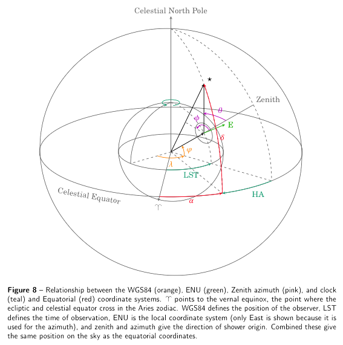

Coordinate systems in HiSPARC
=============================

A document detailing the coordinate systems and units used in the
HiSPARC experiment. Other coordinate systems that are encountered, such
as that of CORSIKA are also explained. Formulae for the conversion
between the systems are also given.

These conversions are implemented in the transformations module of the
[SAPPHiRE](https://github.com/HiSPARC/sapphire), the Python framework
for HiSPARC.

